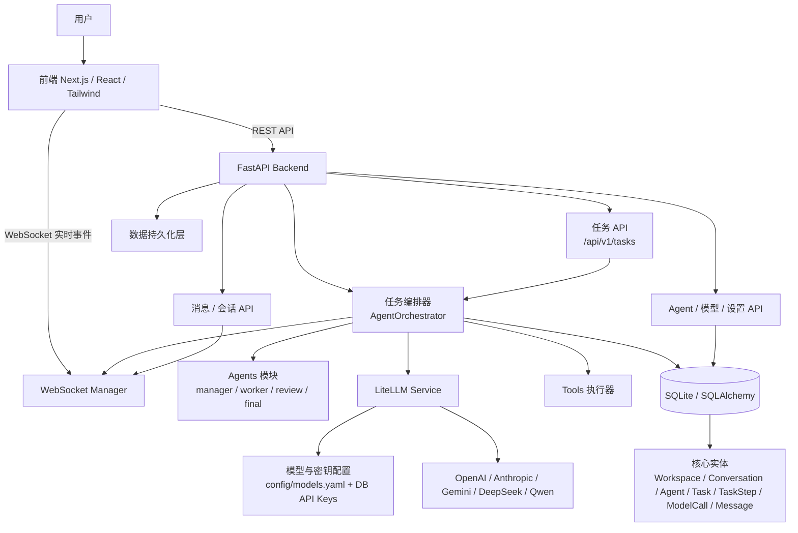

# Agent Console

<h4 align="center">寂静飞控台 · The Quiet Flight Desk</h4>

<p align="center">
  <strong>多智能体不再散落各处。一张深色运控台，看见全局，精准调度。</strong>
</p>

<p align="center">
  
  
  
  
  
</p>

---

## 这是什么

一个**本地优先的多 Agent 运控台** — 不是聊天玩具，不是 Demo 花架子。

你打字，Agent 干活。Manager 拆任务，Worker 各自执行，QA 审核，最后汇总。
全程可视：每一步执行、每一次模型调用、每一次降级切换，全在 WebSocket 实时
推到你面前。

```
你: "重构订单模块并更新前端页面" @项目总设计师
      │
      ▼
Manager 拆解 ──→ Worker 1: Agent工程师  ──→ Worker 2: 前端设计师
      │                    │                        │
      ▼                    ▼                        ▼
QA 审核 ←──────────────────────────────────────────┘
      │
      ▼
Manager 汇总 ──→ 最终结果回到群聊
```

## 架构



### 架构说明

- 前端负责控制台、群聊、任务流、模型设置与实时状态展示。
- FastAPI 后端提供任务、消息、Agent、模型与设置接口。
- `AgentOrchestrator` 负责任务领取、状态流转、步骤记录与结果回写。
- `LiteLLM Service` 统一封装模型调用，支持自定义模型与 fallback。
- `WebSocket Manager` 将任务、步骤、模型调用、Agent 状态变化实时推送给前端。
- SQLite 作为当前默认存储，所有核心实体都通过 SQLAlchemy 持久化。

## 任务流转

```mermaid
flowchart TD
    A[创建任务] --> B[run_task(task_id)]
    B --> C[_claim_pending_task\n领取 PENDING 任务并加租约]
    C --> D[启动 lease 续期线程\n_renew_task_lease]
    D --> E{assigned_agent 是 Manager?}

    E -- 否 --> S1[单 Agent 流程]
    E -- 是 --> M1[多 Agent 流程]

    S1 --> S2[校验 agent / conversation]
    S2 --> S3[update_agent_status(running)]
    S3 --> S4[save_task_step(running)]
    S4 --> S5{启用 tools?}
    S5 -- 否 --> S6[call_agent_model]
    S6 --> S7[save_model_call]
    S5 -- 是 --> S8[_run_agent_with_tools]
    S8 --> S8a[循环模型调用]
    S8a --> S8b[保存 tool_call step]
    S8b --> S8c[execute_tool]
    S8c --> S8d[追加 tool 结果到 history]
    S8d --> S8a
    S8a --> S7
    S7 --> S9[save_task_step(completed)]
    S9 --> S10[update_task_status(COMPLETED)]
    S10 --> S11[update_agent_status(idle)]
    S11 --> S12[send_result_message]
    S12 --> Z[结束]

    M1 --> M2[读取 workspace 的全部 Agent]
    M2 --> M3[Manager: running]
    M3 --> M4[save_task_step(manager_plan)]
    M4 --> M5[manager_agent.generate_plan]
    M5 --> M6[parse / serialize plan]
    M6 --> M7[save_task_step(completed)]
    M7 --> M8[send_result_message: 任务拆解]
    M8 --> M9[Manager: idle]

    M9 --> M10[按 plan.subtasks 顺序执行]
    M10 --> M11[选择对应 Worker Agent]
    M11 --> M12[Worker: running]
    M12 --> M13[save_task_step(worker_execute_x)]
    M13 --> M14{启用 tools?}
    M14 -- 否 --> M15[worker_agent.execute_subtask]
    M14 -- 是 --> M16[_run_agent_with_tools]
    M16 --> M16a[循环模型调用 + tool 执行]
    M16a --> M15
    M15 --> M17[save_task_step(completed)]
    M17 --> M18[send_result_message: Worker 结果]
    M18 --> M19[Worker: idle]
    M19 --> M10

    M10 --> M20[Review Agent: running]
    M20 --> M21[save_task_step(review_results)]
    M21 --> M22[review_agent.review_results]
    M22 --> M23[save_task_step(completed)]
    M23 --> M24[send_result_message: 审核结果]
    M24 --> M25[Review Agent: idle]

    M25 --> M26[Manager 再次 running]
    M26 --> M27[save_task_step(final_summary)]
    M27 --> M28[final_agent.build_final_result]
    M28 --> M29[save_task_step(completed)]
    M29 --> M30[update_task_status(COMPLETED)]
    M30 --> M31[update_agent_status(idle)]
    M31 --> M32[send_result_message: 最终汇总]
    M32 --> Z

    S1 -.异常.-> F[失败处理\nsave_task_step(failed) / save_model_call(failed)\nupdate_task_status(FAILED)\nupdate_agent_status(failed)]
    M1 -.异常.-> F
    F --> Z
```

### 任务流转说明

- 所有任务先进入 `PENDING`，由 Orchestrator 领取后切到 `RUNNING`。
- 单 Agent 任务会直接调用目标 Agent 完成任务。
- Manager 任务会先生成计划，再按子任务顺序交给 Worker 执行，之后由 QA 审核，再由 Manager 汇总。
- 每个阶段都会记录 `TaskStep`，每次模型调用都会记录 `ModelCall`。
- 任务结束时会更新任务状态、Agent 状态，并通过 WebSocket 推送结果。
- 发生异常时会进入失败分支，尽可能保留失败步骤、失败调用和错误消息。

## 六人 Agent 编队

| Agent | 角色 | 绑定模型 |
| --- | --- | --- |
| 项目总设计师 | 拆解任务 / 最终汇总 | `manager_model` |
| Agent 工程师 | 后端逻辑实现 | `code_model` |
| 前端设计师 | 前端页面实现 | `code_model` |
| 知识库管理员 | 长文写作与整理 | `writing_model` |
| 测试专员 | QA 审核 | `review_model` |
| 运维 | 部署与运维 | `code_model` |

每个 Agent 有自己的 system prompt，模型可独立配置。`config/models.yaml` 定义
了降级链 — 主 Provider 挂了自动切备用，切成功了会标 `fallback_used: true`。

## 模型与密钥管理

前端「设置」页（`/settings`）内置完整的模型管理能力，无需改配置文件：

**API Key 管理** — 直接在前端填入各 Provider 的密钥，存进数据库，无需重启
服务。密钥解析优先级：**数据库 > 环境变量**。已配置的 Key 永远不回传前端，
只有 `configured` 布尔状态。

```
PUT    /api/provider-keys/{provider}   保存密钥
DELETE /api/provider-keys/{provider}   删除密钥
```

**自定义模型** — 不再局限于 `models.yaml` 的 5 个预设模型。可以添加任意
`provider/model` 组合（如 `openai/gpt-4o`、`anthropic/claude-sonnet-4`），
支持配置 fallback 降级链，添加后立即可测试连通性、可被 Agent 绑定使用。

```
GET/POST/DELETE   /api/custom-models    自定义模型增删查
```

支持的 Provider：OpenAI、Anthropic、Gemini、DeepSeek、Qwen（DashScope）。

## 设计哲学

深色暖石墨底，信号琥珀只标记"现在看这里"。没有紫蓝渐变，没有霓虹描边，
没有玻璃拟态。状态始终用颜色 + 图标 + 文字三重表达。

> *"技术感来自结构，不来自装饰。"*

更多细节见 [DESIGN.md](DESIGN.md)。

## 事件总线

一个 WebSocket 连接，六种事件，按工作区隔离：

```
ws://localhost:8000/ws/workspaces/{id}

message.created       → 消息气泡实时出现
task.status_changed   → 任务徽章变色
task.step_changed     → 步骤时间线推进
agent.status_changed  → Agent 状态灯切换
model.call_finished   → 模型调用日志追加
error                 → 错误横幅弹出
```

前端 4 个 Hook（`useChat`、`useTasks`、`useAgentConsole`、`useSettings`）
共用同一个 `useWorkspaceSocket`，3 秒断线自动重连，事件合并逻辑全部去重到
`lib/task-utils.ts`。

## 一分钟跑起来

**Windows 一键启动**（推荐）— 双击 `start.bat` 或运行 `start.ps1`，
自动复制 `.env`、启动服务、等待就绪后打开浏览器。

或手动：

```powershell
Copy-Item .env.example .env
docker compose up --build
```

- 前端 → http://localhost:3000
- API 文档 → http://localhost:8000/docs
- 健康检查 → http://localhost:8000/api/v1/health

打开浏览器，默认工作区和 6 个 Agent 已就位。输入 `@项目总设计师 帮我...` 回车。
API Key 直接在 `/settings` 页面填入即可，无需重启。

## 质量基线

| 项 | 状态 |
| --- | --- |
| 后端 pytest | 40 passed |
| 前端 Node test | 28 passed |
| ESLint | 0 errors / 0 warnings |
| TypeScript + Next build | 编译通过 |
| 失败恢复 | 进程重启自动恢复未完成任务 |
| 失败持久化 | 主 Session 坏了用 fallback Session 补刀 |
| 并发控制 | 单工作区最多 3 个进行中任务，超了 429 |

## 关键决策记录

**为什么 `asyncio.create_task` 而不是 Celery？**
MVP 阶段不值得引入消息队列的运维复杂度。`run_task(task_id)` 入口已经设计为
无状态函数 — 未来加一行 `celery_app.send_task("run_task", args=[task_id])`
即可切换。`orchestrator.py` 里也标了 `asyncio.gather` 并行化的 TODO，
等 PostgreSQL 到位后改一行代码就开。

**为什么 SQLite 而不是 PostgreSQL？**
零配置。`Base.metadata.create_all` 一把梭。迁移到 PostgreSQL 只需改
`DATABASE_URL`，所有 SQLAlchemy 模型都是标准定义，不依赖 SQLite 方言。
Alembic 在 Schema 变频繁之前引入即可。

**为什么进程内 WebSocket 而不是 Redis Pub/Sub？**
单进程够用，`WebSocketManager` 就是个 `dict[int, set[WebSocket]]`。
`broadcast_to_workspace` 接口不变，未来把实现换成 Redis 通道即可，
所有调用方一行不动。

## 最近一次打磨（本轮）

- `useWorkspaceSocket` — 4 个 Hook 里一模一样的 35 行 WebSocket 逻辑，现在一处定义
- `taskTimestamp` / `taskStatusRank` / `shouldApplyTaskStatus` — 两处各自定义，现在一个 `lib/task-utils.ts`
- 死代码清退 — `SystemStatus`、`SoftwareDock`（6 个"待接入"占位符）、`selectConsoleAgents`（后端已过滤又过滤一遍）
- `ErrorBoundary` — 5 个页面各套一层，组件崩了不白屏
- `fetchedRef` — StrictMode 下不会重复请求两次
- `TaskStepEventPayload` — 手写 dict 换成 Pydantic Schema，和其他事件一致
- 模型成本 — `ModelCall.cost` 以前恒为 0，现在从 LiteLLM 响应提取
- 测试 — 前端从 2 个涨到 28 个

### 下一轮（本轮）

- **用户管理 API Key** — `ProviderCredential` 表 + `/api/provider-keys` 三接口，
  前端设置页可直接填入/删除密钥，数据库优先于环境变量解析
- **自定义模型接入** — `CustomModelConfig` 表 + `/api/custom-models` 三接口，
  前端可添加任意 `provider/model` 组合并配置 fallback，无需改 YAML
- **API Key 显示修复** — 修复眼睛图标切换失效的 BUG（`undefined` 与 React 批处理冲突），
  保存后清空明文输入
- 测试 — 后端 37 → 40（新增自定义模型 CRUD、解析、集成覆盖）

## 路线图

- [ ] Alembic 迁移
- [ ] Redis 消息队列替代 `asyncio.create_task`
- [ ] Worker 并行化（SQLite → PostgreSQL 后启用 `asyncio.gather`）
- [ ] Redis Pub/Sub 多进程广播
- [ ] QA 不通过 → Worker 重试循环
- [ ] 前端 WebSocket/Hook 端到端测试
- [ ] `/contacts` 通讯录页面

## License

选好了再发。
