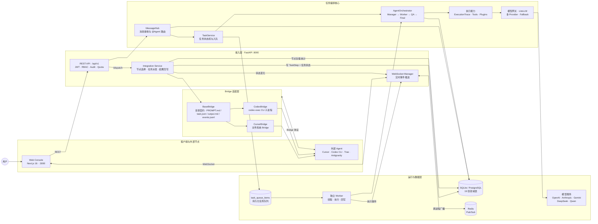
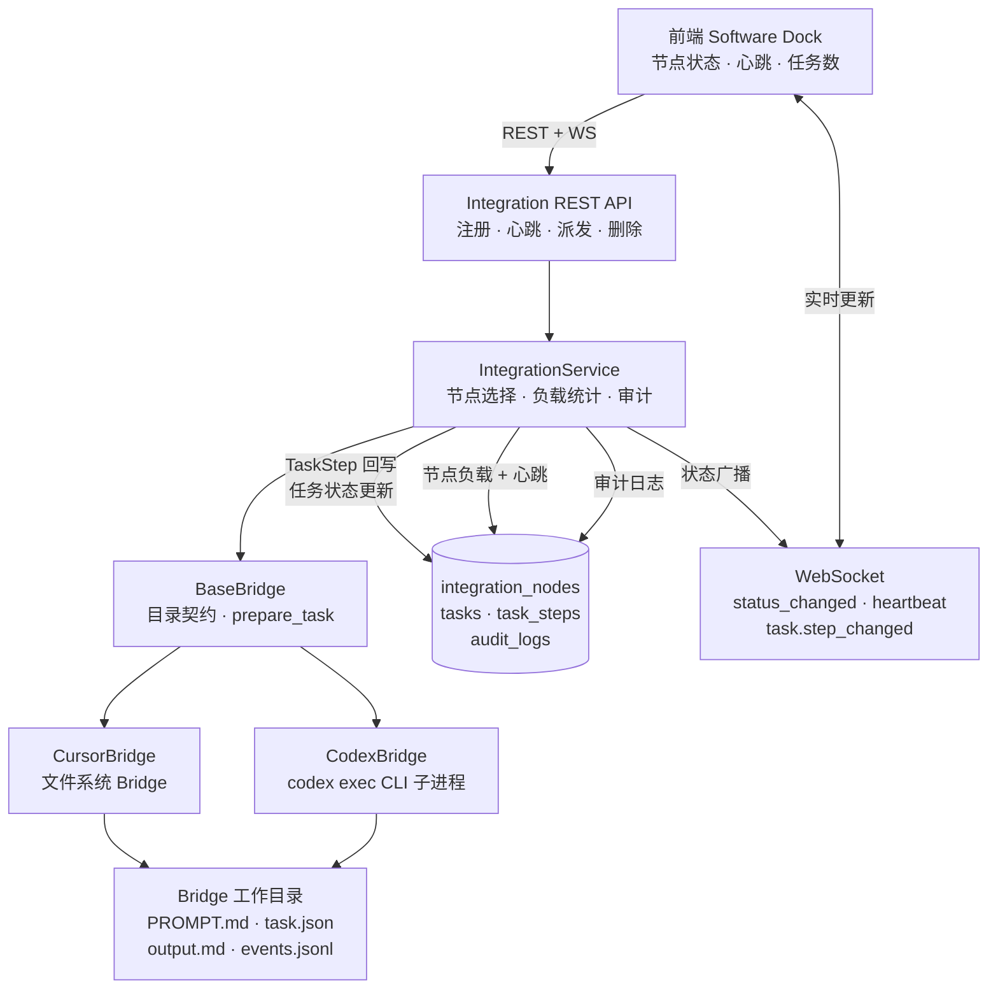

# Agent Console

一个本地优先的多智能体协同运行台。你在群聊里 @某个 Agent 派活，后端自动拆解、分发、执行、审核、汇总，全程 WebSocket 实时推送到前端面板。

不做聊天玩具，不做黑盒。每一步流转、每次工具调用、每个 Token 消耗，都看得见。

---

## 技术栈

| 层 | 选型 |
|---|---|
| 后端 | FastAPI · Python 3.11+ · SQLAlchemy 2.0 Async |
| 前端 | Next.js 16 (App Router) · React 19 · TypeScript |
| 样式 | Tailwind CSS v4 (OKLCH) · shadcn/ui · Lucide |
| 数据库 | SQLite（开发）/ PostgreSQL（生产），19 张领域表 |
| 模型层 | LiteLLM 统一适配 OpenAI / Anthropic / Gemini / DeepSeek / Qwen |
| 实时 | FastAPI WebSocket + Redis Pub/Sub |
| 认证 | PBKDF2 + JWT + 4 级 RBAC |

不依赖 LangChain 或 AutoGen。编排逻辑自己写，工具调用自己控，上下文自己管。

---

## 架构



---

## 怎么跑

### Windows 一键启动

双击 `start.bat`。脚本会拷贝 `.env`、拉起 Docker、轮询健康检查、打开浏览器。

### 手动启动

```bash
# 后端
cd backend
pip install -r requirements.txt
python -m uvicorn app.main:app --reload --port 8000

# 前端
cd frontend
npm install
npm run dev
```

打开 [http://localhost:3000](http://localhost:3000)。

---

## 数据库表

19 张表，覆盖用户、工作区、权限、任务、消息、模型、审计、配额、插件、工作流、外部节点：

```
workspaces              workspace_memberships    workspace_invitations
users                   agents                  conversations
messages                tasks                   task_steps
task_queue_items        model_calls             provider_credentials
custom_model_configs    quota_configs           audit_logs
plugins                 workspace_plugins        workflow_templates
integration_nodes
```

SQLite 启动时自动建表。切 PostgreSQL 只需改 `DATABASE_URL`。

---

## 编队

系统初始化拉起 6 个 Agent：

| Agent | 干什么 |
|---|---|
| 项目总设计师 | 拆需求、分任务、汇总交付 |
| Agent 工程师 | 后端逻辑、算法、API |
| 前端设计师 | 界面、组件、交互 |
| 知识库管理员 | 文档、资料、检索 |
| 测试专员 | QA、验收、缺陷定位 |
| 运维 | 部署、Docker、稳定性 |

每个 Agent 绑定一个模型位（`manager_model` / `code_model` / `writing_model` / `review_model`），在 `config/models.yaml` 里配到具体 Provider。

---

## 页面

| 路由 | 干什么 |
|---|---|
| `/` | 集群总览：Agent 负载、外部节点心跳、Software Dock |
| `/chats` | 群聊：@Agent 派活，Markdown 渲染，自动触发流水线 |
| `/contacts` | Agent 花名册 |
| `/tasks` | 任务列表 |
| `/tasks/[id]` | 任务详情：执行轨迹、工具调用链、时序回放、断点恢复 |
| `/workflows` | 工作流模板：DAG 编排，填参数一键实例化 |
| `/settings` | 设置中心（成员 / 审计 / 成本 / 配额 / 插件） |
| `/login` `/register` | 认证 |

---

## 编排流程

```
用户 @项目总设计师 "重构订单模块"
    │
    ▼
Manager 拆解 → Worker 1: Agent工程师
             → Worker 2: 前端设计师
    │
    ▼
QA 审核 ← Worker 结果回传
    │
    ▼
Manager 汇总 → 写回群聊
```

关键点：

- 任务进 `task_queue_items` 持久化队列，独立 Worker 消费
- 每轮模型调用前，`ExecutionTrace` 从数据库拼装结构化上下文回灌（任务摘要 + 当前阶段 + 已完成步骤 + 工具结果 + 失败原因）
- 工具调用形成显式闭环：模型请求 → 执行 → 结果回灌下一轮
- 超长上下文自动摘要裁剪，关键状态不丢
- 失败后重试，模型能读到失败前上下文接着跑

---

## 工具调用

Agent 支持 Function Calling。内置 4 个工具：

| 工具 | 用途 |
|---|---|
| `calculate` | AST 白名单安全算术 |
| `query_tasks` | 查任务历史 |
| `get_agents` | 查当前工作区 Agent 列表 |
| `get_system_status` | 查 Provider 配置状态 |

工具循环最多 5 轮，每轮结果持久化为 `TaskStep`。

插件注册中心支持上传 JSON Manifest 注册外部工具，按工作区挂载与启用，Agent 执行时自动注入。

---

## 模型管理

- API Key 在前端 `/settings` 填入，存数据库，`DB > 环境变量` 优先级
- Key 永不在列表回传，日志全脱敏
- 支持任意 Provider/Model 组合（如 `anthropic/claude-3-5-sonnet`）
- 主模型 429/500/超时时，沿降级链自动重试，日志标 `fallback_used: true`

---

## 外部 Agent 软件接入

Software Dock 不再是静态展示。`Cursor`、`Codex CLI`、`Trae`、`Antigravity` 等外部 Agent 软件可以注册为执行节点，纳入统一调度。



### 调度链路

```
POST /api/v1/integrations/dispatch
  │
  ├─ 校验 task 与 node 同工作区
  ├─ IntegrationService.dispatch_task_to_node()
  │   ├─ 选择节点（手动指定 or 自动：能力匹配 + 负载最小化 + 心跳优先）
  │   ├─ 节点负载 +1，状态 → busy
  │   ├─ BaseBridge.prepare_task() → 生成工作目录与上下文文件
  │   ├─ 创建 TaskStep（running）→ WebSocket 广播 task.step_changed
  │   ├─ Bridge.execute() → 外部 Agent 执行
  │   ├─ TaskStep 标记 completed/failed，写入结果
  │   ├─ Task 状态更新（completed/failed），result 写回
  │   ├─ 节点负载 -1，状态 → online/busy
  │   ├─ 审计日志 integration_node.dispatch
  │   └─ WebSocket 广播 integration.status_changed + task.status_changed
  └─ 返回 BridgeResult（success / message / artifacts / metadata）
```

### Bridge 目录约定

```
data/bridges/
  workspace-<id>/
    Cursor/
      task-<task_id>/
        PROMPT.md        # 任务输入与上下文
        task.json        # 结构化任务元数据
        output.md        # 最终文本结果
        events.jsonl     # 事件流或进度流
    Codex/
      task-<task_id>/
        PROMPT.md
        task.json
        output.md
        events.jsonl
```

### API

| 接口 | 用途 |
|---|---|
| `POST /api/v1/integrations/nodes` | 注册节点 |
| `GET /api/v1/integrations/nodes` | 节点列表 |
| `POST /api/v1/integrations/nodes/{id}/heartbeat` | 心跳上报 |
| `POST /api/v1/integrations/dispatch` | 派发任务到节点 |

WebSocket 推送 `integration.status_changed` / `integration.heartbeat` / `task.step_changed` 事件，前端实时更新。

### Codex CLI 接入示例

```bash
npm install -g @openai/codex
codex  # 首次登录

# 派发任务
curl -X POST http://localhost:8000/api/v1/integrations/dispatch \
  -H "Content-Type: application/json" \
  -d '{"task_id": 42, "node_id": 2}'
```

Bridge 会调用 `codex exec --json --sandbox workspace-write -o output.md "任务描述"`，结果保存到 `data/bridges/workspace-{id}/Codex/task-{id}/`。

---

## 权限

4 级 RBAC：

| 角色 | 能做什么 |
|---|---|
| owner | 一切 |
| admin | 管成员、配额、插件、工作流 |
| member | 派任务、看任务 |
| viewer | 只读 |

工作区隔离：不同工作区看不到彼此的 Agent、任务、消息、节点。

所有关键操作自动写 `audit_logs`：登录、成员变更、插件启停、任务执行。

---

## 测试

```bash
# 后端
cd backend
python -m pytest tests/ -q

# 前端
cd frontend
npm test
npm run lint
npm run build
```

当前：后端 109 tests passed，前端 28 tests / lint 0 errors / build pass。

---

## 配置

复制 `.env.example` 为 `.env`，按需填写：

```bash
# 模型 Key（任填一个即可启动）
DEEPSEEK_API_KEY=sk-xxx
OPENAI_API_KEY=sk-xxx

# 可选
APP_API_TOKEN=         # 设了就开启 Bearer 鉴权
TASK_EXECUTION_MODE=inline  # 改 worker 则 API 只入队
WORKER_CONCURRENCY=2
```

---

## 项目结构

```
├── backend/
│   ├── app/
│   │   ├── api/v1/endpoints/    # REST 路由（agents / tasks / plugins / integrations ...）
│   │   ├── core/                # orchestrator / config / auth / permissions
│   │   ├── models/              # 19 张 SQLAlchemy 模型
│   │   ├── schemas/             # Pydantic 请求与响应
│   │   ├── services/            # litellm / tools / bridge / cursor_bridge / codex_bridge / integration_service
│   │   ├── websocket/           # WebSocket manager / events / distributed
│   │   └── worker.py            # 独立 Worker 入口
│   ├── tests/                   # 109 个测试
│   └── requirements.txt
├── frontend/
│   ├── src/
│   │   ├── components/          # UI 组件（software-dock / agent-gallery / status-panel ...）
│   │   ├── hooks/               # use-integrations / use-workspace-socket / use-tasks ...
│   │   ├── types/               # TypeScript 类型定义
│   │   └── app/                 # Next.js App Router 页面
│   └── package.json
├── docs/
│   ├── prd/                     # 20 份 PRD 文档
│   ├── PRD.md                   # 变更追踪表（129 行）
│   ├── generate_change_log.py   # 从 git history 自动生成变更表
│   └── build_prd_html.py        # 生成单页 PRD.html 阅读器
├── docker-compose.yml
├── start.bat / start.ps1
└── .env.example
```

---

## License

MIT
