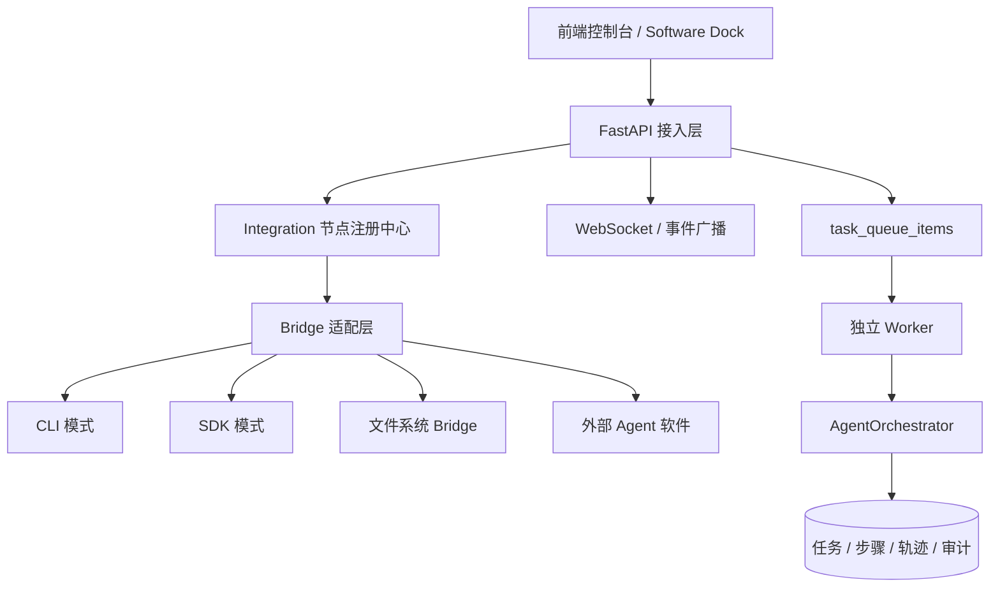

# 外部 Agent 软件接入技术方案

> 适用范围：`Cursor`、`Codex CLI`、`Trae`、`Antigravity` 等外部 Agent 软件接入本项目的统一设计。
>
> 文档定位：这是技术方案，不是产品 PRD。本文只描述接入边界、协议、实现方式、任务流与后续演进，不重复业务目标与验收标准。

## 1. 背景

当前系统已经具备以下基础能力：

- 任务消息中心 `MessageHub`
- 持久化任务队列 `task_queue_items`
- 独立 Worker 消费进程
- 任务编排器 `AgentOrchestrator`
- WebSocket 实时事件通道
- 工作区隔离、RBAC、审计日志、配额治理
- 插件注册中心与工具调用框架

这意味着系统已经不再只是一个聊天控制台，而是一个可以承载执行节点的任务运行平台。

外部 Agent 软件的接入目的，不是把这些工具“嵌进去展示”，而是把它们变成系统里的**可调度执行节点**。这样系统的控制面仍然统一，而执行面可以根据能力、成本和稳定性进行分层编排。

---

## 2. 接入结论

### 2.1 能不能接入

**可以接入，但必须按“节点化 + 桥接层”方式接入，不能按普通库调用方式接入。**

原因很简单：

- 这些软件本身是独立进程、独立 UI、独立权限边界，不是本项目内部模块
- 不同软件的交互方式不同，有的有 CLI，有的有 SDK，有的更偏 IDE，有的更偏本地 Agent 框架
- 本项目需要的是统一调度能力，而不是“直接调用某个厂商的桌面应用”

### 2.2 总体判断

| 软件 | 当前接入成熟度 | 推荐接入方式 | 备注 |
|---|---|---|---|
| Codex CLI | 高 | CLI 子进程桥接 | 已有明确的 `codex exec`、`--json`、`workspace-write`、`-o` 能力，最适合做标准节点 |
| Antigravity | 高 | CLI / SDK / MCP | 官方公开的 CLI 与 SDK 适合做平台级节点 |
| Cursor | 中 | 文件系统 Bridge / 本地工作区桥接 | 更适合做“受控 IDE 节点”，不建议假定存在稳定后端 API |
| Trae | 中低 | 预留适配器 + CLI/Bridge 探测 | 接口成熟度需要持续跟踪，优先做协议层预留 |

---

## 3. 设计原则

### 3.1 统一控制面，分散执行面

系统内部只维护一套任务状态机、事件流和工作区权限。外部软件不参与控制面决策，只执行被分配的任务。

### 3.2 所有节点都必须可观测

任何外部节点只要进入系统，就必须至少提供：

- 在线 / 离线 / 忙碌 / 错误 状态
- 最后心跳时间
- 版本信息
- 当前任务数
- 最大并发数
- 可用能力列表
- 任务执行结果

### 3.3 节点必须绑定工作区

外部软件不允许跨工作区自由读取或修改任务上下文。每个节点只在绑定的工作区内可见、可调度、可追踪。

### 3.4 接入方式按成熟度分层

不是所有软件都用同一套执行方式。系统应支持三类接入：

- **CLI 模式**：标准输入/输出或 JSONL 事件流
- **Bridge 模式**：本地桥接服务，负责文件、命令和上下文交互
- **SDK 模式**：通过官方库或 Python/Node 程序化调用

---

## 4. 总体架构



控制面在本项目内，执行面在外部软件内。

---

## 5. 核心数据模型

### 5.1 `integration_nodes`

建议作为外部节点主表，字段如下：

| 字段 | 说明 |
|---|---|
| `id` | 主键 |
| `workspace_id` | 所属工作区 |
| `name` | 节点名，如 `Cursor`、`Codex` |
| `provider` | 提供方标识，如 `cursor`、`codex` |
| `mode` | 接入模式：`cli` / `bridge` / `sdk` / `api` / `automation` |
| `status` | `offline` / `online` / `busy` / `error` / `connecting` |
| `version` | 节点版本 |
| `capabilities_json` | 能力列表 JSON |
| `endpoint` | Bridge 地址、CLI 标识或远程 endpoint |
| `config_json` | 节点配置 |
| `last_heartbeat_at` | 最后心跳 |
| `current_task_count` | 当前任务数 |
| `max_concurrency` | 最大并发 |
| `created_at` / `updated_at` | 时间戳 |

### 5.2 可选派发表

如后续需要详细追踪调度，可拆分：

- `integration_heartbeats`
- `integration_dispatches`
- `integration_executions`

当前阶段可先复用任务轨迹和审计日志，避免过早分表。

---

## 6. 统一接口协议

### 6.1 Bridge 抽象

所有外部软件都通过一个统一抽象接入：

```text
connect()
heartbeat()
dispatch_task()
collect_result()
disconnect()
```

### 6.2 任务对象

桥接层接收的任务对象至少包含：

- `task_id`
- `workspace_id`
- `title`
- `description`
- `context`
- `capabilities`
- `priority`
- `deadline`
- `working_directory`

### 6.3 结果对象

桥接层返回的结果对象至少包含：

- `success`
- `message`
- `artifacts`
- `metadata`
- `exit_code` 或 `error`

---

## 7. 各软件接入方法

### 7.1 Codex CLI

Codex CLI 是最适合先落地的节点类型。

可用能力：

- `codex exec "..."`
- `--json` 输出 JSONL 事件流
- `--sandbox workspace-write` 允许受控写入
- `-o output.md` 保存最终消息
- 适合脚本化、CI 化、队列化执行

推荐实现：

1. 后端从队列中取任务
2. 创建节点工作目录
3. 生成 `PROMPT.md` / `task.json`
4. 调用 `codex exec`
5. 解析 stdout / stderr / JSONL 事件
6. 将结果写回任务轨迹和消息流

适合的职责：

- 代码修改
- 代码审查
- 自动修复
- 任务总结
- 批量生成变更说明

### 7.2 Cursor

Cursor 更适合做“受控 IDE 节点”，而不是无头服务节点。

推荐模式：

- 通过本地工作区目录共享上下文
- 用文件系统桥接传递任务输入与结果
- 让 Cursor 读取 `PROMPT.md`、输出 `output.md`
- 如未来有稳定插件、扩展或 MCP 能力，再升级接入方式

不建议：

- 把 Cursor 假定成稳定的远程 API 服务
- 依赖未经验证的内部接口

### 7.3 Trae

Trae 当前更适合按“预留节点”处理。

推荐模式：

- 先统一注册协议和数据模型
- 先打通 Bridge 接口
- 具体执行方式可落到 CLI 或本地工作区交互
- 等官方接口成熟后再补稳定适配器

### 7.4 Antigravity

Antigravity 的公开方向比较明确：

- 有 CLI
- 有 SDK
- 支持 MCP
- 支持 Python 程序化控制

因此它适合做平台级可编排节点。

推荐模式：

- CLI 模式用于简单执行
- SDK 模式用于更深度集成
- MCP 用于扩展工具与外部数据源

---

## 8. 任务派发流程

### 8.1 手动派发

用户在前端选择节点后：

1. 前端请求 `POST /api/v1/integrations/dispatch`
2. 后端根据 `task_id` 找到任务
3. 检查节点是否属于同一工作区
4. 构造 bridge task
5. 执行任务并返回结果
6. 写回任务轨迹、节点状态和 WebSocket 事件

### 8.2 自动派发

当用户未指定节点时，系统按以下规则选择：

1. 先按工作区过滤
2. 再按状态筛选 `online` / `busy`
3. 再按能力匹配
4. 再按当前负载最小化
5. 再按最近心跳时间优先
6. 如果失败，可回退到其他节点或系统内置编排器

### 8.3 回写逻辑

结果写回至少包括：

- 任务执行状态
- 节点状态
- 执行摘要
- 产物路径
- 错误信息
- 审计日志
- WebSocket 广播事件

---

## 9. 任务执行生命周期

```text
任务入队
  -> 选择节点
  -> 创建 bridge workdir
  -> 生成 prompt/context 文件
  -> 启动外部软件执行
  -> 采集 stdout/stderr/JSONL/产物
  -> 写回结果
  -> 更新节点负载与心跳
  -> 广播前端状态
```

### 9.1 目录约定

建议桥接目录结构：

```text
data/bridges/
  workspace-<id>/
    Cursor/
      task-<task_id>/
        PROMPT.md
        task.json
        output.md
        events.jsonl
    Codex/
      task-<task_id>/
        PROMPT.md
        task.json
        output.md
        events.jsonl
```

### 9.2 日志约定

- `PROMPT.md`：任务输入与上下文
- `task.json`：结构化任务元数据
- `output.md`：最终文本结果
- `events.jsonl`：事件流或进度流
- `artifact/`：可选结果文件

---

## 10. 安全边界

### 10.1 工作区隔离

每个节点只可操作其绑定工作区，不允许跨工作区读取或写入。

### 10.2 权限最小化

外部 Agent 默认只给最小权限：

- Codex CLI：优先 `workspace-write`
- 高风险场景：需要显式开启更高权限
- 自动化节点：必须有超时和熔断

### 10.3 凭证保护

- API Key 不写入日志
- 结果回传不得包含敏感凭证
- 节点配置中的 secret 需脱敏存储

### 10.4 审计

所有派发、失败、回退、重新派发必须进审计日志。

---

## 11. 实现顺序建议

### 第一阶段：协议和数据模型

- `integration_nodes`
- Bridge 抽象类
- 节点状态广播
- 任务派发接口

### 第二阶段：先落 Codex CLI

- `CodexBridge`
- `codex exec` 子进程封装
- JSONL 事件解析
- 结果落盘与回写

### 第三阶段：再补 Cursor Bridge

- 文件系统桥接
- 本地工作区上下文
- 结果文件回写

### 第四阶段：扩展 Trae / Antigravity

- Trae 先预留适配器
- Antigravity 视 SDK / CLI 成熟度接入

### 第五阶段：调度增强

- 能力匹配
- 负载均衡
- 失败回退
- 节点健康评分
- 多节点并行执行

---

## 12. 当前项目中的实现状态

目前项目已经落了这些基础件：

- `integration_nodes` 数据模型
- 外部节点 REST API
- 心跳接口
- `CursorBridge`
- `CodexBridge`
- `Software Dock` 动态展示
- 节点种子数据
- WebSocket 集成事件

也就是说，项目已经不是“只放了个名字”，而是已经进入了**可接入、可调度、可扩展**的阶段。

真正欠缺的，是把调度链路补完整：

- 自动派发策略
- 任务回写到轨迹
- 节点负载统计
- 外部 Agent 的执行结果与任务详情联动

---

## 13. 风险

| 风险 | 说明 | 处理方式 |
|---|---|---|
| 官方接口不稳定 | 某些 IDE 不公开稳定 API | 用 Bridge 和目录约定兜底 |
| 节点黑盒化 | 软件内部执行过程不可见 | 强制事件流与产物落盘 |
| 权限过大 | 外部 Agent 误改代码或泄漏密钥 | 最小权限、审计、脱敏 |
| 调度失衡 | 节点负载不均 | 引入负载/能力/心跳评分 |
| 回退复杂 | 外部节点失败后如何续跑 | 将失败原因回灌到 Orchestrator |

---

## 14. 结论

外部 Agent 软件是可以接入系统的，但接入方式必须是**桥接化、节点化、协议化**，而不是把它们当作普通库直接调用。

本项目的长期方向应当是：

- 控制面统一
- 节点面开放
- 调度面可替换
- 执行面可观测
- 结果面可回放

这样，`Cursor`、`Codex CLI`、`Trae`、`Antigravity` 才不是摆在页面上的名字，而是真正可用的执行资源。
